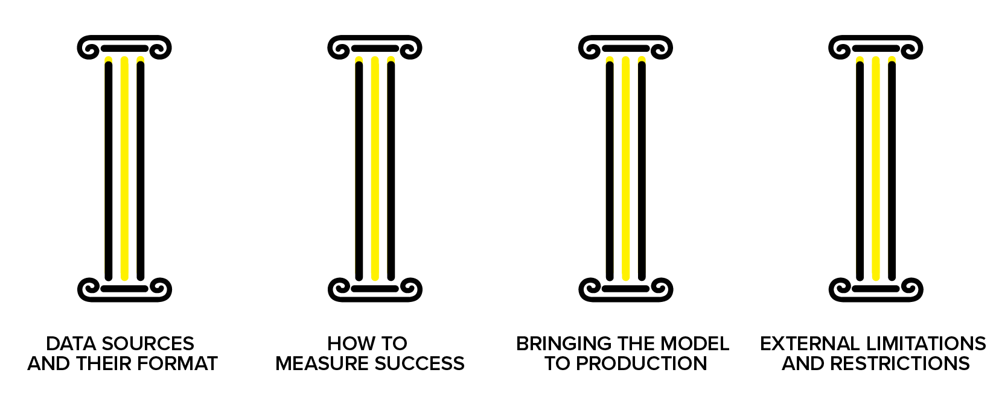
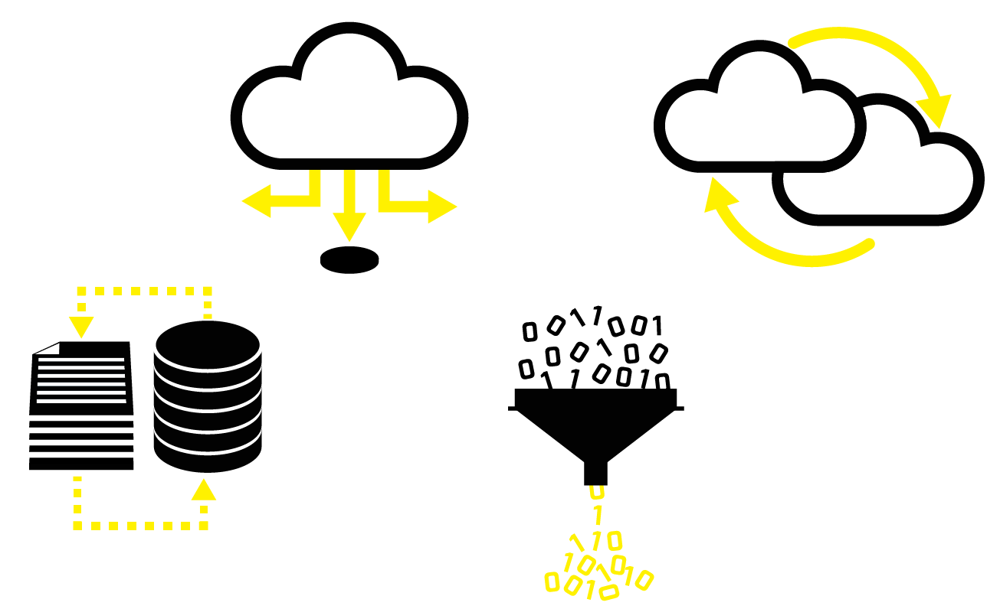
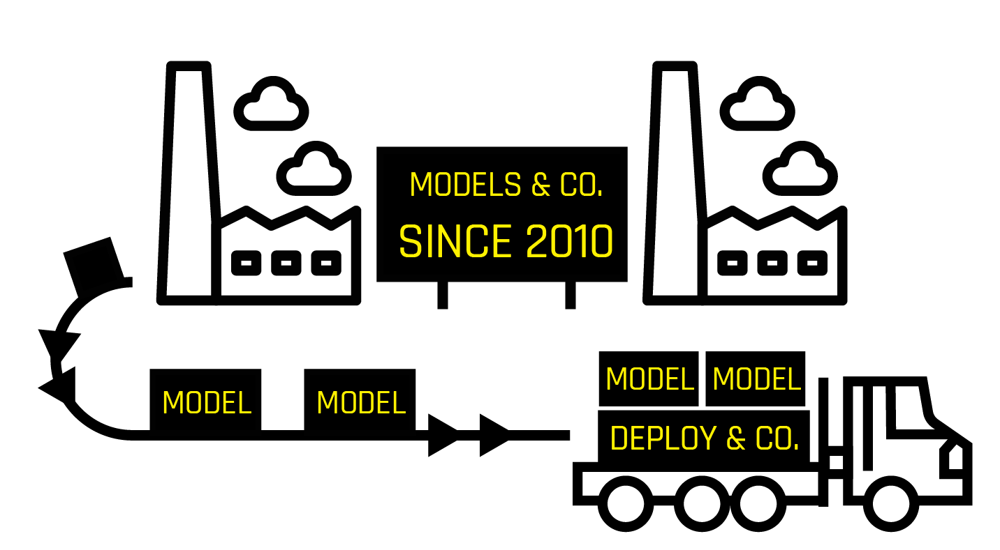

# Deploying Models to Maximise the Impact of Machine Learning - Part 1

## Introduction to the 4 key pillars of considerations for model deployment (1st part of a blog series)

So you have built a machine learning (ML) model which delivers a high level of accuracy and does not overfit. What value does it have now? Well, at the moment, nothing, zero, diddly squat. There is no economic value in a machine learning model that never sees the light of day and is not used in production making business decisions.

So how can data scientists cover the "last mile" to that elusive end zone that is named production? How do we quickly make the most of the model that has been built? For many organisations this is the toughest nut to crack and there are many valid paths that can be taken to deployment. What questions should we be asking to determine the path we should take? They are built on a foundation based around 4 pillars. These are:

1. Data Source and Format
2. How To Measure Success
3. Bringing the Model to Production
4. External Limitations and Restrictions

During a subsequent number of additional blogs that we will publish as part of this series, we will explore these 4 pillars in more detail.  This first blog will provide an overview and introduction into these important topic areas.

## Data Source and Their Format

Some of the key questions and pointers that need to be asked are:

* Will the same data with the same structure be available in production when the predictions are calculated?

* Is the data source and prediction destination reachable from the machines where it will be ingested by the ML framework? One of the most common *showstoppers* in an enterprise environment is the lack of network access, low bandwidth and a long roundtrip (don't repeatedly transfer big data sets over the ocean) of your data and among systems involved. Solving these problems may take long weeks and substantial effort so plan and test and involve IT ahead of time.

* Is the storage system compatible with the connectors available in the ML platform and the data format is well supported. It may look trivial to change the representation and location of your data sets when experimenting with sample small data but all changes when you start increasing the volume of your data.

* Will the *ML framework fit the data set size*? Avoid the lure of using heavy-duty frameworks for simple problems but also beware that many claim to be big data ready, few really are. No matter the power of the machine learning solution, you need to make sure that you're not including a possibly large burden of data that is not necessary as part of the scoring process. Measuring data set size is important. Both the physical size (GBs) and the number of rows and columns pose a computational challenge to the machine learning task. Columns and rows downsampling may be required to decrease the required run time, proper exploratory data analysis and preliminary modelling may let you reduce the data set too. Chunking or mini batching can also be considered especially when it comes to moving the models into a production scoring environment.

## How to Measure Success

No matter what you do, at the end of the day, you should be able to tell success from failure. Beauty may be found in all things, however, let us consider some more objective metrics.

### Translate to Business
Are you able to express the expectations of the non-technical consumer of your ML models to be built in a formalised way using standard ML metrics?

### Model Testing and Other Metrics
Based on the discussion with the business, the nature of the data set, and other inputs, it is vital that we incorporate the correct validation strategy of our models, choose the right scorers and data set splits. The stability, sensitivity, fairness and interpretability of the model, need to be considered as well. It is also likely a number of other KPIs need to be met once the model is put into production: For example:
* For online business or low latency trading, we need good predictions being computed within a given time period otherwise they become obsolete.
* IoT / edge devices require the models to be small in size and predictions computationally inexpensive to generate due to the limited memory and possibly battery life.

### Model Decay
Everyone wants the freshest model in production however you need to be balancing fresh with the hassle that this brings. How fast do your models decay? How severely will the decreased accuracy impact your business case? How costly is it to retrain the model and redeploy the new one into production? What overhead does it have? Are you able to replace the old model with a new one without bringing down the whole operation and if not, what is the cost of such a maintenance window? How often are you able to collect data from your systems for retraining of the models? How large is the gap in the historical data between 'now' and the last data point that was collected? These imposed costs of having a fresh model in productions have to be evaluated with business stakeholders.

### Staging of Models
Sadly, we have to design and select the right model before we see it shine or fail in deployment. Therefore we try to measure the quality of the model in the testing phase as well as possible. To this end, we need to establish and further maintain baseline criteria that will determine whether we've managed to build a model that is likely to be good enough to bring value when replacing the current model in production. If we have no model in production, we just need to rely on lab results.

When a new version of a software component is being developed, it is often the case that the release candidate gets promoted through the series of staging areas. Such progression usually includes the need to pass automated unit tests, integration tests, some form of manual testing, performance testing and eventually acceptance user testing. There is no reason not to treat machine learning models differently. Following the notion of economy of scale, one may easily benefit from the existing process by adding machine learning models as another component of the software engineering process in place. 

To further mitigate the risk of a new model roll-out have you considered A/B testing it?

### Model Monitoring
To ensure that our model keeps performing reasonably well in production we need to monitor the same qualities as we have in the lab. A model only understands the patterns from the data it was trained from.  As data patterns and data values change what is the impact on the quality of results being inferred from the model?

Does the data change substantially compared to our training data set? If other KPIs fall outside an expected value range what do we do? We can keep a back-up older model in place to fall back to and/or have some simpler backup system ready (like your old pre-machine learning rule based model). It is always a good practice to use the standard dev-ops alerts that are very likely to be implemented for the application using the machine learning model.

On top of the metrics, we also may want to generate metadata documenting what input has been seen, which values were unknown to the models (unseen categorical values, invalid input or even run time errors). We need to decide if this information needs to be processed in real-time to trigger some immediate actions or offline batch recording is enough for later post-mortem analysis. Do you have some proven logging sink or journals in place? Use these over adding new destinations of your records.

### Resource Utilisation
We've talked about application metrics but the principles of prudent management of the assets command us also to monitor the usage of resources such as compute, memory, and storage. The consumption of resources is extremely variable and very use case specific.  For serious business cases, it is prudent to avoid excessive hardware sizing.  On the other hand, if models are seeing an increase in consumption then this should trigger the operations team to increase the resource pool.  This would prevent a sudden drop in performance occurring due to the lack of resources.

## Bringing the Model to Production

### Multi-tennant Environment
Many enterprises serve multiple tenants at once. It is important to distinguish between the cases where different tenants can benefit from using a common machine learning model trained on a joined data set, and the case where such an approach may lead to suboptimal results (mainly inaccuracy). The legal impact of such a trade-off often conditions the possibility of such an optimisation.

### High Availability
Just like any other software component, a certain number of "9s" of availability may be (possibly contractually) required from your scoring logic deployment. Have you considered notions of advanced load balancing with auto-scaling, "exactly once" execution, or the warm start of deployed models?

### Versioning
Like with other assets, there is a good reason to keep old models archived and versioned. Authorities may require you to document the underlying logic of business at any moment in the past, internal audit may be required by executives or a flaw in a current model may enforce a rollback to the last known correct version of the model. There is little value in storing just the plain model. Metadata describing the parameters and structure of the model together with production metrics discussed earlier need to be stored too. For experimenting with new ideas using methods like A/B testing and versioning of the models with their KPIs is invaluable.

### Integration of Scoring Logic
It is impossible to foresee all the different flavours of scoring logic integration. Underestimating the proper planning of integration has led to the situation where productionisation of great machine learning models has taken significantly longer than the actual model development.

H2O.ai has had this in mind for a long time. We understand that a trained model itself has to be as agile as possible providing the user of its platform with a large number of ways the deployment can be carried out. One vital characteristic common to all of the deployment flavours is the self-containedness of the scoring logic not needing any H2O.ai server-like infrastructure.

In further posts we will expand on these deployment patterns so here is a list of them in no particular order:

* Bash-like file->file stand-alone scoring invokable on an operating system process level operable by UNIX(-like) system admin tools like Cron
* Batch scoring of data within a database (RDBMS, Hadoop, NoSQL, …)
* Micro Service spanning across several different implementations of a self-hosted (RESTful) service with JSON/binary content both on-premise and cloud
* Automated deployment to one of the scalable cloud services like AWS Lambda
* Tight code-level integration with the ML models by embedding the scoring logic using runtime libraries decoupled from the actual model being served as run-time dependency in form of a data file
* (Near) real-time scoring with stream processing systems like Kafka or Flink
* Spark Pipelines deployment utilising H2O.ai models as native Spark pipelines operating on Spark data structures

## External Limitations and Restrictions
In simple words - what was possible in the R&D lab may be a very serious problem in the target environment.

### Privileged Access
A very unpleasant discovery may be a need for privileged access to run scoring logic or set up the dependencies of the scoring run time. This may be an unsolvable problem or may take very long to resolve.

### Hermetic Environment
Access to sensitive data may require a hermetically closed environment without access to the internet or other sources of dependencies. Lazily resolved dependencies or just model deployment processes requiring an online dependency resolution may not be available and missed deadlines may occur during fixing this issue.

### Legal Limitation
Neural Networks and other methods may not be available due to regulatory reasons. Make sure that even legal departments are part of the inception discussions to mitigate such risks.

## In Summary
We hope you have enjoyed the first part of our thoughts around maximising the impact of machine learning and would value all feedback that you have.

## What’s Next?
In the next part (Part 2) of this blog series, we will drill down into the considerations that organisations need to think about with regards to the data sources and format that are feeding their model deployments.